# Session 10 — Core Kubernetes Objects, Lifecycles, and Deployments

**Author:** Amrutha Tavva 
**Evidence note:** Run commands against a running local cluster, paste actual output, and replace placeholders with screenshots. Paths below follow the supplied course repository.

## Actual execution record (20 September 2026)

The Minikube control-plane node reached `Ready` on Kubernetes `v1.37.0`. `nginx-pod` reached `1/1 Running` on node `minikube` with Pod IP `10.244.0.4`; `hello-pod` completed successfully and logged `Hello Kubernetes` then `Complete`. The deliberately invalid image produced both `ErrImagePull` and `ImagePullBackOff` events.

## 1. Cluster baseline

Verify client/server access, control plane, CoreDNS endpoint, and node readiness.

```powershell
kubectl version --output=yaml
kubectl cluster-info
kubectl get nodes -o wide
```

**Pass condition:** control plane and CoreDNS URLs are reported; every node is `Ready`.  
**Evidence:** 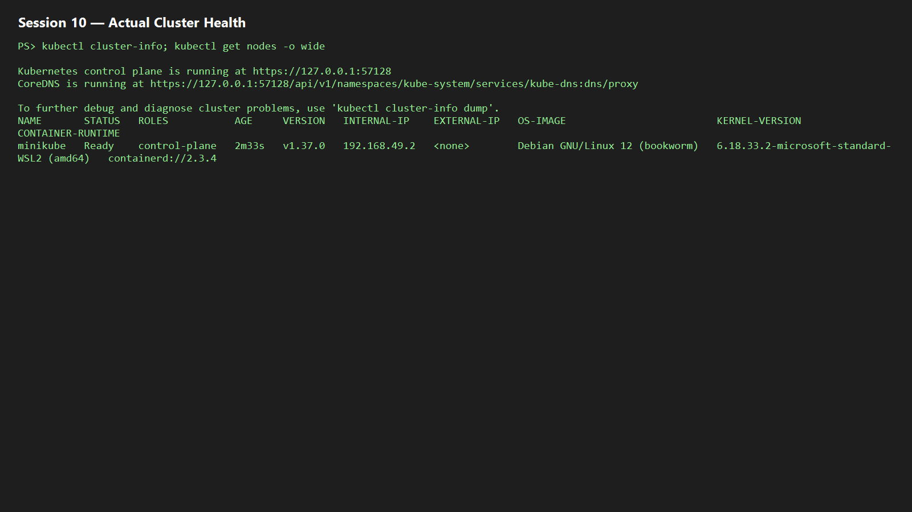

## 2. Nginx Pod: deploy, inspect, and delete

```powershell
kubectl apply -f pod.yml
kubectl get pods
kubectl get pods -o wide
kubectl logs nginx-pod
kubectl delete -f pod.yml
kubectl get pods
```

**Pass condition:** the pod reaches `1/1 Running`, then is removed. `-o wide` shows its IP and node.  
**Evidence:** 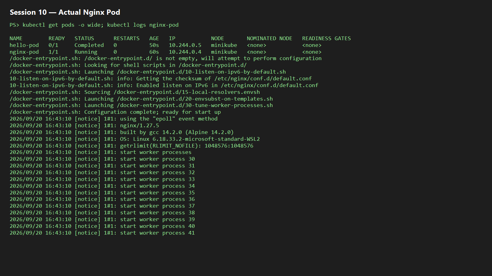

## 3. ErrImagePull / ImagePullBackOff

```powershell
kubectl apply -f pod-lifecycle/06-imagepullbackoff.yaml
kubectl get pods lifecycle-image-error
kubectl describe pod lifecycle-image-error
kubectl delete -f pod-lifecycle/06-imagepullbackoff.yaml
```

**Explanation:** the API server can accept and store a syntactically valid Pod object in etcd, but the node runtime later cannot fetch the non-existent image. Kubelet reports `ErrImagePull`, retries with backoff, then shows `ImagePullBackOff`.  
**Evidence:** 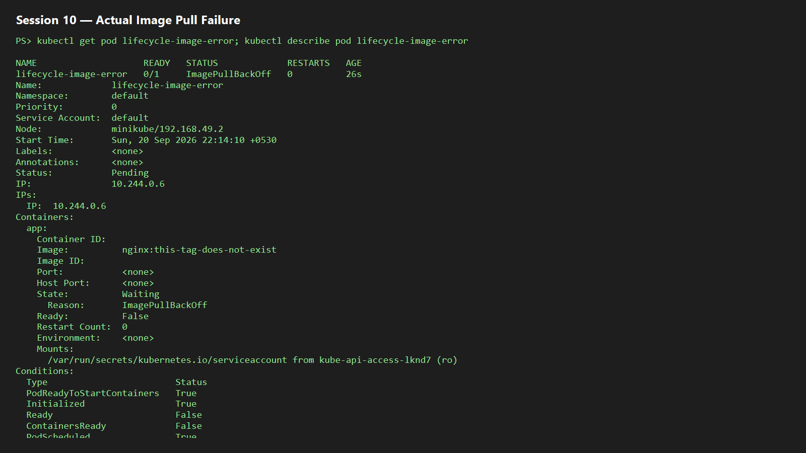

## 4. Short-lived Pod lifecycle

In one terminal, watch Pods; in another, apply the BusyBox manifest.

```powershell
kubectl get pods -w
kubectl apply -f hello.yml
kubectl get pod hello-pod
kubectl logs hello-pod
kubectl delete -f hello.yml
```

**Pass condition:** capture `ContainerCreating` → `Running` → `Completed` (`Succeeded`) for a `restartPolicy: Never` Pod.  
**Evidence:** 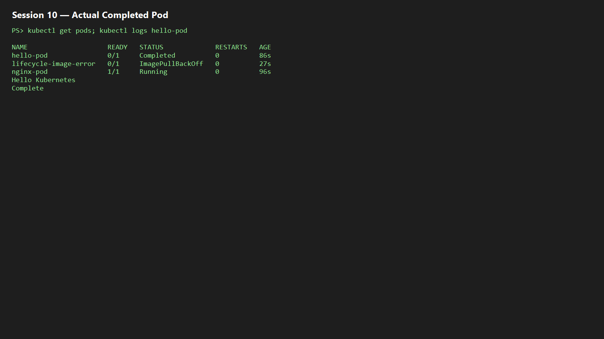

## 5. Pod lifecycle and probes

```powershell
cd pod-lifecycle
kubectl apply -f 01-running.yaml; kubectl get pod lifecycle-running
kubectl apply -f 02-pending.yaml; kubectl describe pod lifecycle-pending
kubectl apply -f 03-succeeded.yaml; kubectl get pod lifecycle-succeeded
kubectl apply -f 04-failed.yaml; kubectl get pod lifecycle-failed
kubectl apply -f 05-crashloopbackoff.yaml; kubectl logs lifecycle-crashloop --previous
kubectl apply -f 06-imagepullbackoff.yaml; kubectl describe pod lifecycle-image-error
kubectl apply -f 07-readiness.yaml; kubectl get pod lifecycle-readiness
kubectl apply -f 08-liveness.yaml; kubectl get pod lifecycle-liveness -w
kubectl apply -f 09-startup.yaml; kubectl get pod lifecycle-startup
kubectl apply -f 10-init-container.yaml; kubectl describe pod lifecycle-init
kubectl apply -f 11-multi-container.yaml; kubectl logs lifecycle-multi-container -c sidecar
kubectl apply -f 12-termination.yaml; kubectl delete -f 12-termination.yaml
kubectl delete -f .
```

| Manifest | Expected observation |
|---|---|
| `01-running` | A healthy Running Pod. |
| `02-pending` | `Pending` with a `FailedScheduling` event due to impossible resource request. |
| `03/04` | `Succeeded` on exit 0; `Failed` on exit 1 with restart disabled. |
| `05/06` | Restart backoff after crashes; image pull backoff for invalid image. |
| `07/08/09` | Running is distinct from Ready; liveness restarts unhealthy containers; startup prevents premature liveness failures. |
| `10/11/12` | Init containers finish sequentially; multi-container Pod shows `2/2`; SIGTERM uses grace period. |

**Evidence:** 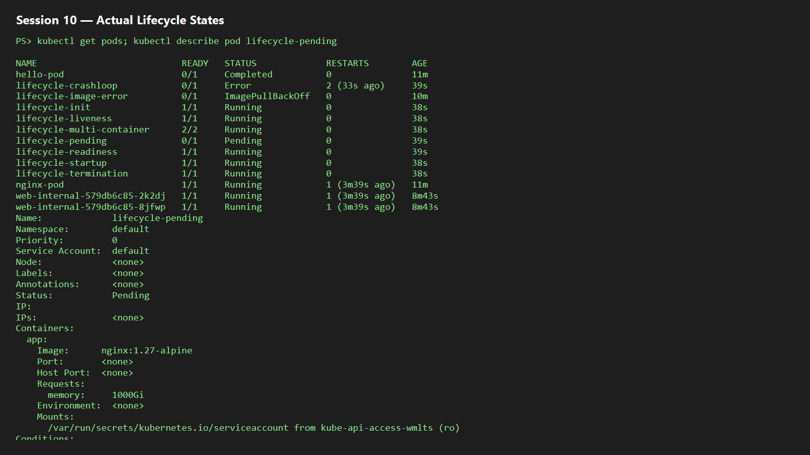  
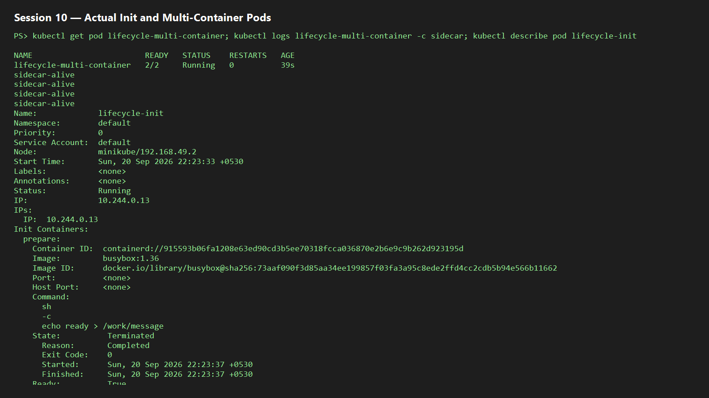

## 6. ReplicaSet and StatefulSet

```powershell
kubectl apply -f ../replicaset.yml
kubectl get rs nginx-rs
kubectl get pods -l app=nginx
kubectl delete pod (kubectl get pods -l app=nginx -o jsonpath='{.items[0].metadata.name}')
kubectl get pods -l app=nginx
kubectl apply -f ../k8s-core-objects/statefulset.yml
kubectl get statefulset mysql
kubectl get pods -l app=mysql
kubectl get pvc
```

**Pass condition:** the ReplicaSet replaces a deleted Pod to preserve its replica count; StatefulSet pods have stable ordinal names such as `mysql-0`, `mysql-1`, and their PVCs are visible.  
**Evidence:** 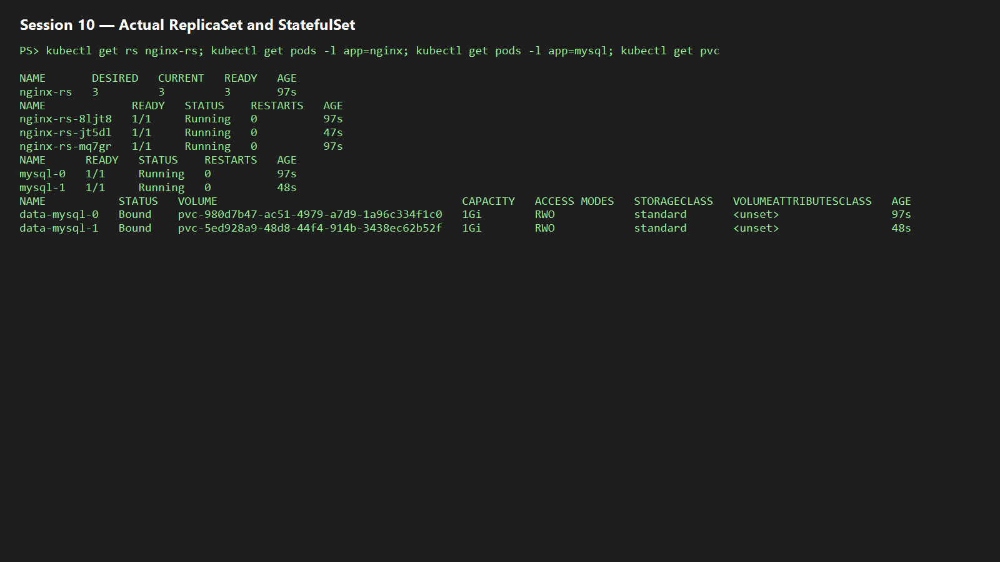

## 7. DaemonSet

```powershell
kubectl apply -f ../k8s-core-objects/deamonset.yml
kubectl get ds node-exporter
kubectl get pods -l app=node-exporter -o wide
kubectl delete -f ../k8s-core-objects/deamonset.yml
```

**Pass condition:** desired/current/ready count equals the eligible node count—one host agent Pod per node.  
**Evidence:** 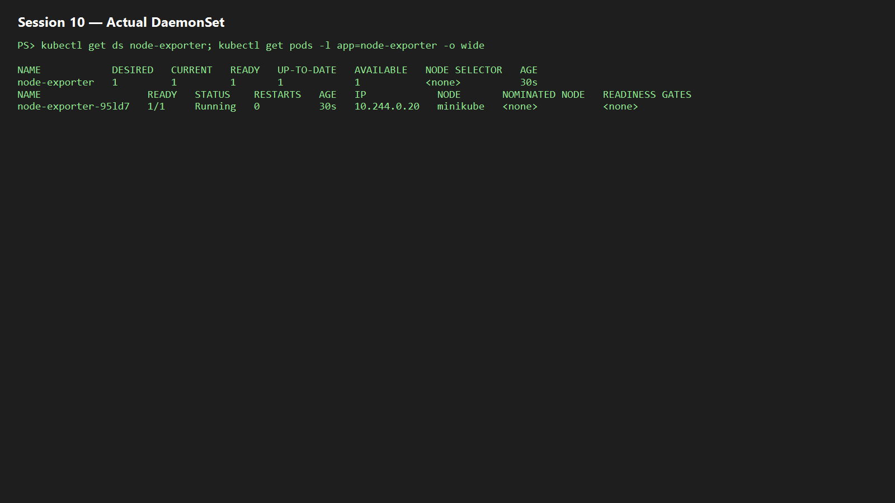

## 8. Rolling update and rollback

```powershell
cd ../01-rolling-update
kubectl apply -f deployment-v1.yaml -f service.yaml
kubectl rollout status deployment/app-rolling
kubectl apply -f deployment-v2.yaml
kubectl rollout status deployment/app-rolling
kubectl rollout history deployment/app-rolling
kubectl rollout undo deployment/app-rolling
kubectl rollout status deployment/app-rolling
```

`maxSurge: 1` allows one extra Pod while `maxUnavailable: 0` keeps all desired replicas available.  
**Evidence:** 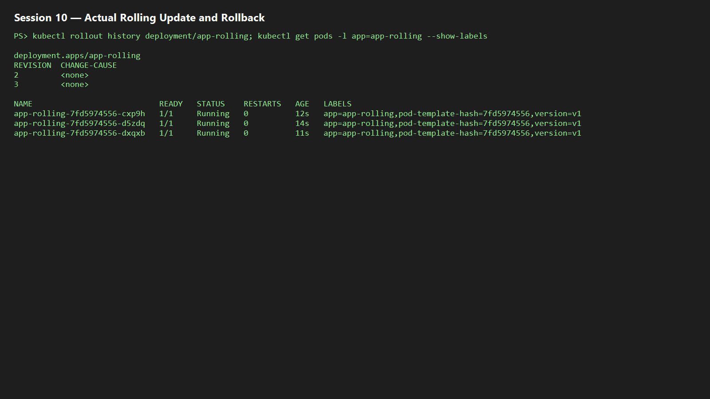

## 9. Troubleshooting drills

```powershell
cd ../troubleshooting
kubectl apply -f broken-image.yaml
kubectl rollout status deployment/yatri-backend --timeout=30s
kubectl get pods -l app=yatri-backend
kubectl rollout undo deployment/yatri-backend
kubectl apply -f selector-mismatch.yaml
```

The broken image stalls the new revision while healthy old Pods can remain available. A selector mismatch is rejected because `spec.selector.matchLabels` must match `spec.template.metadata.labels`; correct the label and reapply.  
**Evidence:** 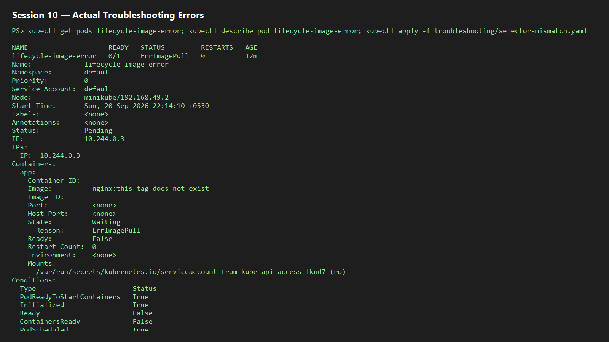

## 10. Concepts

| Item | Meaning |
|---|---|
| `containerPort` | Application port in a container; primarily declarative/documentary. |
| `targetPort` | Destination port on selected Pods. |
| `port` | ClusterIP Service port used inside the cluster. |
| `nodePort` | Node-level external port, normally 30000–32767. |
| Labels / selectors | Labels are object metadata; selectors query and connect matching objects. |
| Requests / limits | Requests influence scheduling; limits cap runtime use. CPU overage is throttled; memory overage can be OOM-killed. |
| GB / GiB | GB = 10^9 bytes; GiB = 2^30 bytes. |

Deployment strategies: **RollingUpdate** incrementally replaces Pods; **Recreate** deletes old before new (downtime); **Blue-Green** switches a Service between complete environments; **Canary** exposes a small v2 subset alongside stable v1. With 4 replicas, surge 1/unavailable 0 permits 5 total Pods and requires 4 available.

**Evidence:** 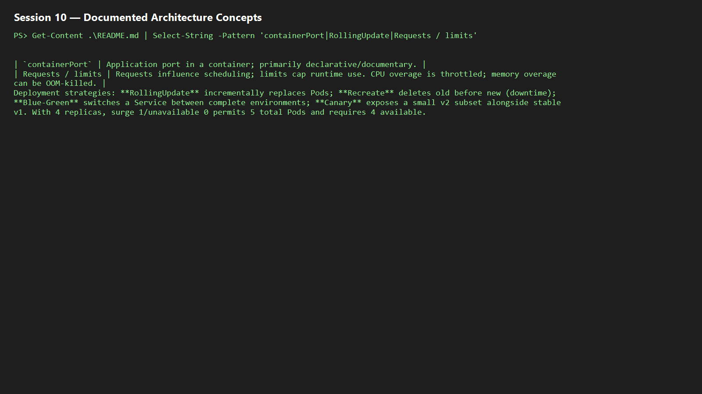

## 11. Blue-Green cutover

```powershell
cd ../02-blue-green
kubectl apply -f deployment-blue.yaml -f deployment-green.yaml -f service-blue.yaml
kubectl get endpoints myapp-service
kubectl apply -f service-green.yaml
kubectl get endpoints myapp-service
kubectl apply -f service-blue.yaml
```

Blue uses `slot=blue`; applying the Green Service changes the selector to `slot=green`, so endpoints flip without deploying during the cutover. Reapply the Blue Service to roll back.  
**Evidence:** 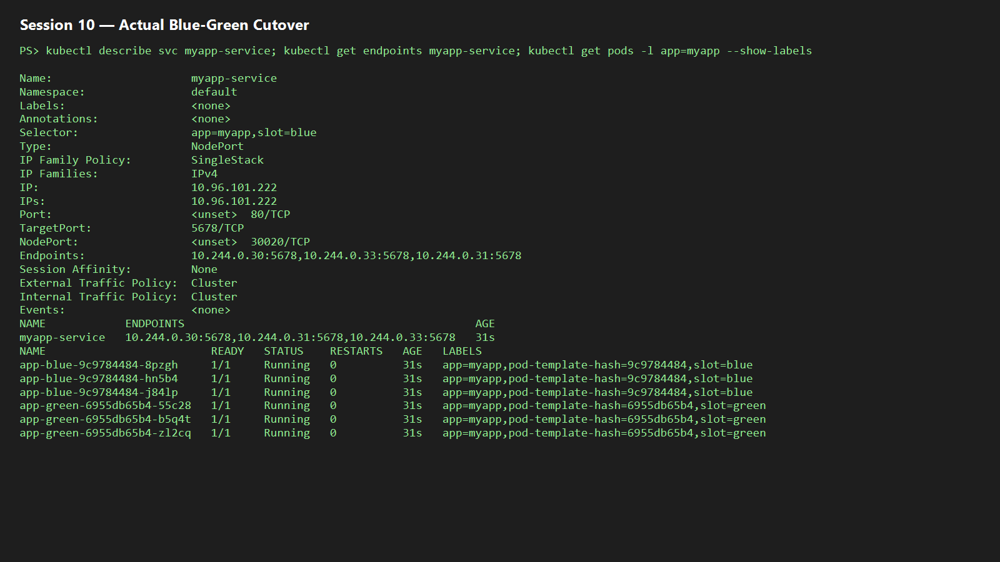

## 12. Canary traffic split

```powershell
cd ../03-canary
kubectl apply -f deployment-stable.yaml -f service.yaml -f deployment-canary.yaml
kubectl get pods -l app=myapp-canary --show-labels
kubectl get endpoints myapp-canary-service
kubectl scale deployment app-canary --replicas=3
kubectl scale deployment app-stable --replicas=7
kubectl scale deployment app-canary --replicas=0
kubectl scale deployment app-stable --replicas=9
```

Nine stable Pods plus one canary approximate a 90/10 distribution because the Service selects both. Scaling to 7/3 changes the approximate share to 70/30; zero canary replicas rolls back.  
**Evidence:** 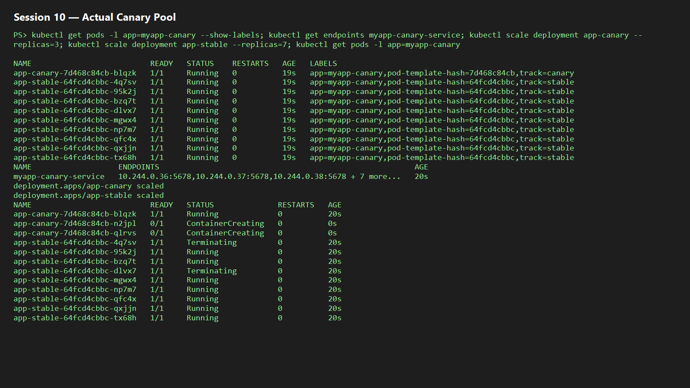

## 13. Recreate deployment

```powershell
cd ../04-recreate
kubectl apply -f deployment-v1.yaml -f service.yaml
kubectl rollout status deployment/app-recreate
kubectl apply -f deployment-v2.yaml
kubectl rollout history deployment/app-recreate
kubectl rollout undo deployment/app-recreate
```

`strategy.type: Recreate` terminates all v1 Pods before creating v2. A continuous request loop should show v1 responses, a brief outage, then v2 responses.  
**Evidence:** 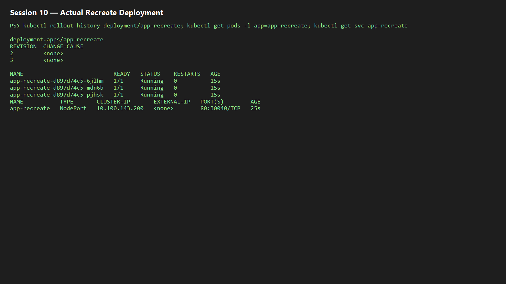
