# Session 11 — Kubernetes Services and Networking

**Author:** Amrutha Tavva  
**Evidence note:** Replace screenshot placeholders with your own terminal captures after running the commands.

## Actual execution record (20 September 2026)

The ClusterIP lab was deployed to Minikube successfully. `web-internal` received ClusterIP `10.99.177.110` and had two ready endpoints: `10.244.0.7:80` and `10.244.0.8:80`.

## 1. Port architecture

```text
Client -> NodeIP:nodePort -> ServiceIP:port -> PodIP:targetPort -> containerPort
```

`containerPort` documents the process port in the Pod. `targetPort` is the Pod port selected by a Service. `port` is the Service's internal ClusterIP port. `nodePort` is an externally reachable port on each node, normally in the 30000–32767 range.  

**Evidence:** 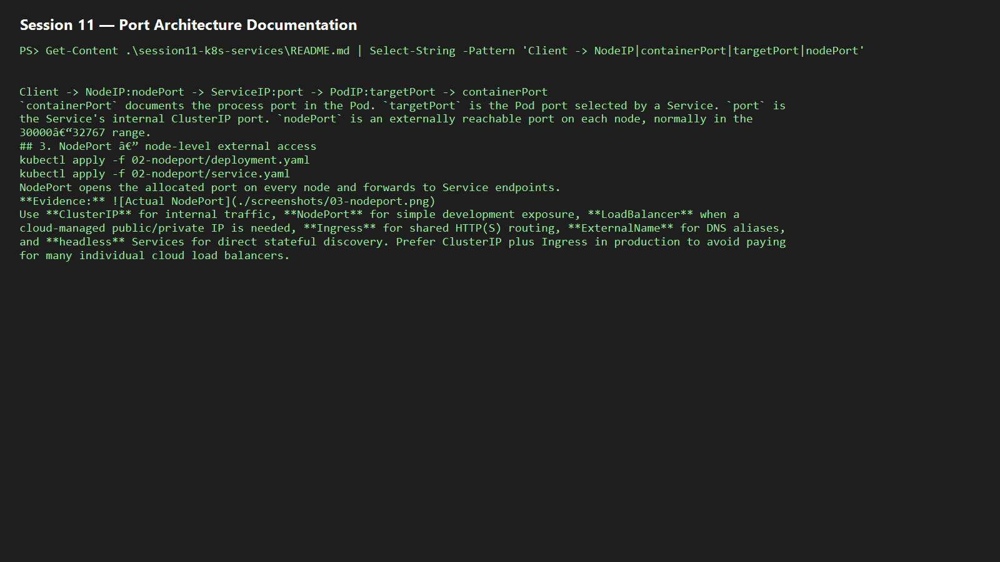


## 2. ClusterIP — default internal Service

```powershell
kubectl apply -f 01-clusterip/deployment.yaml
kubectl apply -f 01-clusterip/service.yaml
kubectl get svc,pods,endpoints
kubectl run curl --rm -it --image=curlimages/curl -- curl http://<service-name>
```

ClusterIP exposes selected Pods only inside the cluster and load-balances across ready endpoints.  
**Evidence:** 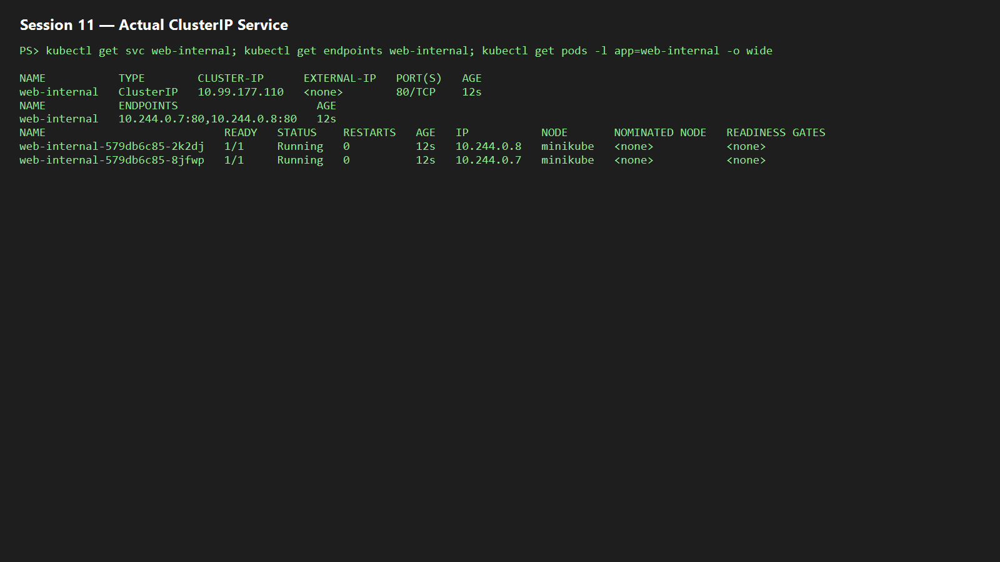

## 3. NodePort — node-level external access

```powershell
kubectl apply -f 02-nodeport/deployment.yaml
kubectl apply -f 02-nodeport/service.yaml
kubectl get svc
minikube service <service-name> --url
```

NodePort opens the allocated port on every node and forwards to Service endpoints.  
**Evidence:** 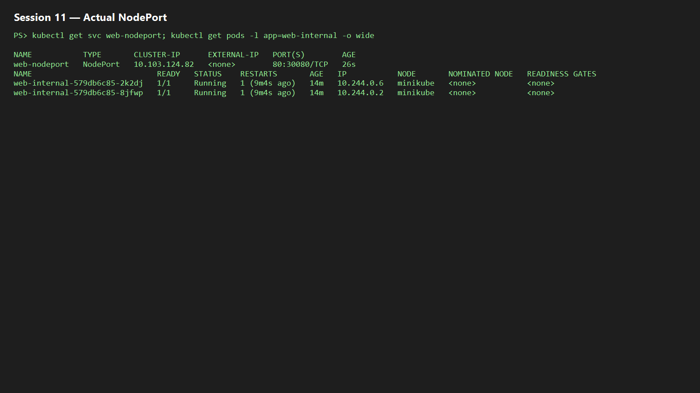

## 4. LoadBalancer — cloud-style external IP

```powershell
kubectl apply -f 03-loadbalancer/deployment.yaml
kubectl apply -f 03-loadbalancer/service.yaml
kubectl get svc -w
minikube tunnel
```

Cloud controllers provision an external load balancer; on Minikube, `minikube tunnel` supplies the local equivalent and must remain running.  
**Evidence:** 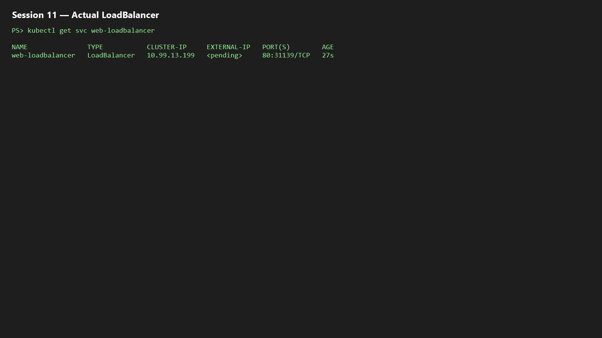

## 5. ExternalName — DNS alias

```powershell
kubectl apply -f 04-externalname/service.yaml
kubectl get svc <service-name> -o yaml
kubectl run dns-test --rm -it --image=busybox:1.36 -- nslookup <service-name>
```

An ExternalName Service creates a CoreDNS CNAME response to an external hostname. It has no selector, ClusterIP, or Pod endpoints.  
**Evidence:** 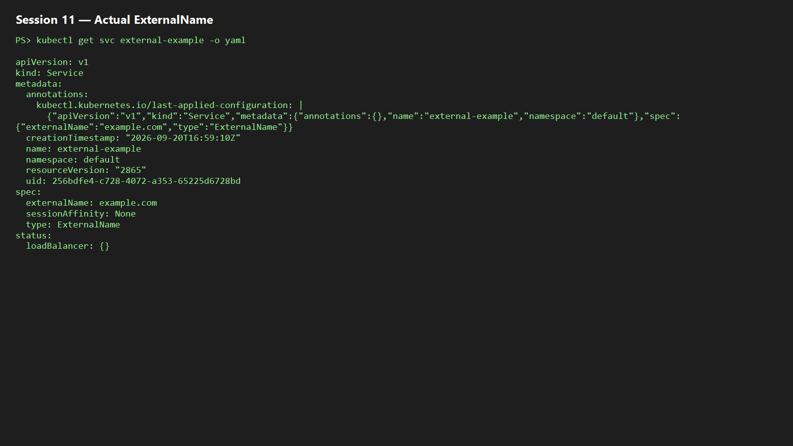

## 6. Headless Service — direct Pod DNS

```powershell
kubectl apply -f 05-headless/service.yaml
kubectl get svc <service-name>
kubectl get endpoints <service-name>
```

With `clusterIP: None`, DNS returns endpoint addresses rather than a virtual Service IP. It is commonly paired with StatefulSets.  
**Evidence:** 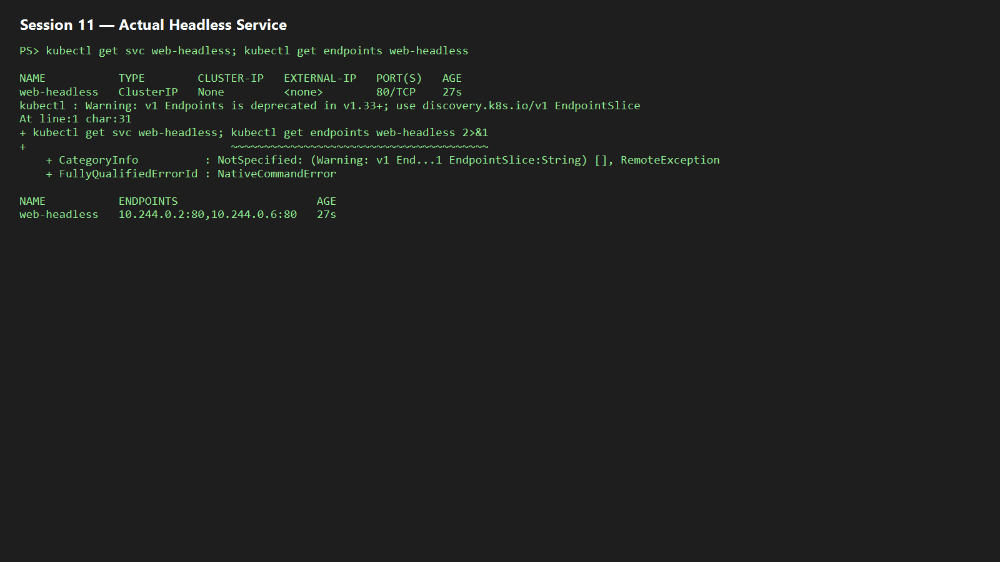

## 7. Service without a selector

```powershell
kubectl apply -f 06-manual-endpoints/service.yaml
kubectl apply -f 06-manual-endpoints/endpoints.yaml
kubectl get svc,endpoints
```

A selector-less Service can map to manually maintained EndpointSlices/Endpoints, useful for external or migration targets. Kubernetes does not automatically create endpoints in this case.  
**Evidence:** 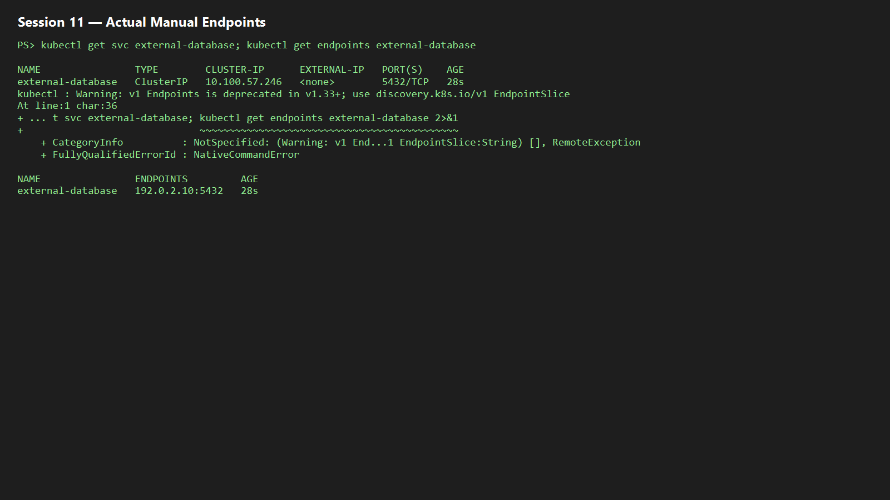

## 8. FQDN and CoreDNS

Service DNS format is `<service>.<namespace>.svc.cluster.local`. A Pod in the same namespace can normally use the short Service name; cross-namespace clients should use at least `<service>.<namespace>`. CoreDNS resolves the Service name to a ClusterIP or, for headless Services, endpoint addresses.

```powershell
kubectl get pods -n kube-system -l k8s-app=kube-dns
kubectl run dns-test --rm -it --image=busybox:1.36 -- nslookup kubernetes.default.svc.cluster.local
```

**Evidence:** 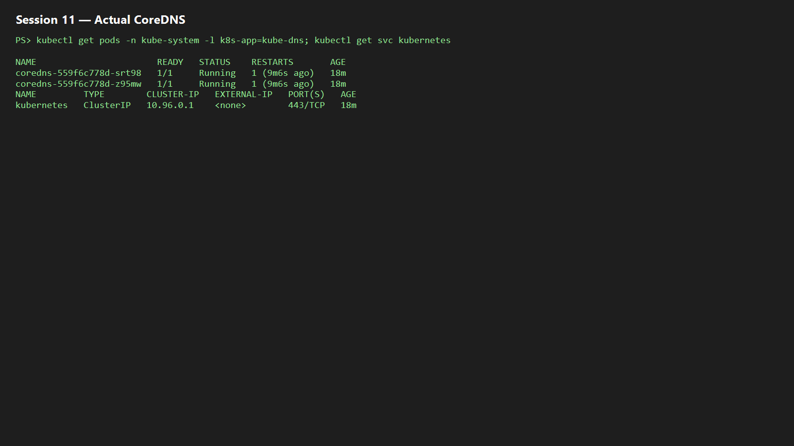

## 9. Pod identity: Deployment vs StatefulSet

```powershell
kubectl get pods -l app=<deployment-app> -o wide
kubectl delete pod <deployment-pod>
kubectl get pods -l app=<deployment-app>
kubectl get pods -l app=<stateful-app>
```

Deployment replacement Pods receive new generated names and may use a different identity. StatefulSet instances retain ordinal identity (`app-0`, `app-1`) and can retain per-Pod storage.  
**Evidence:** 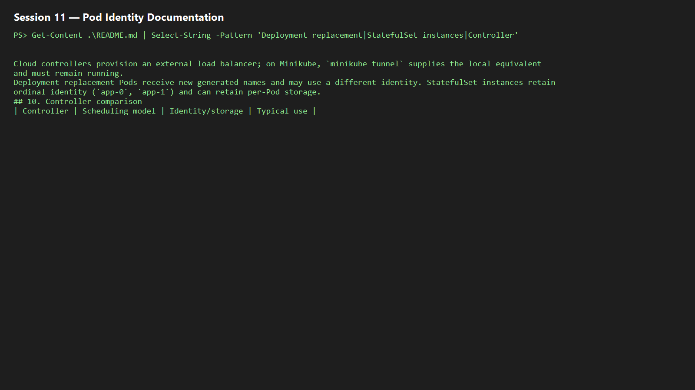

## 10. Controller comparison

| Controller | Scheduling model | Identity/storage | Typical use |
|---|---|---|---|
| Deployment | Desired replica count | Interchangeable Pods | Stateless APIs/web apps |
| StatefulSet | Ordered, stable ordinal Pods | Stable network ID and per-Pod PVC | Databases, queues |
| DaemonSet | One Pod per eligible node | Node-associated agent | Logging, monitoring, security |

**Evidence:** 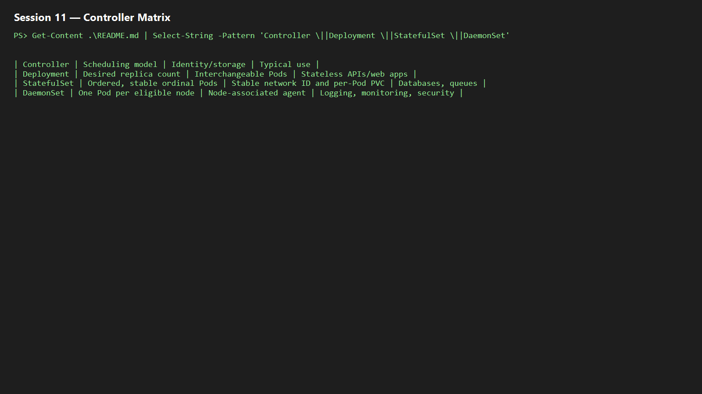

## 11. Service-selection and cost guide

Use **ClusterIP** for internal traffic, **NodePort** for simple development exposure, **LoadBalancer** when a cloud-managed public/private IP is needed, **Ingress** for shared HTTP(S) routing, **ExternalName** for DNS aliases, and **headless** Services for direct stateful discovery. Prefer ClusterIP plus Ingress in production to avoid paying for many individual cloud load balancers.

**Evidence:** 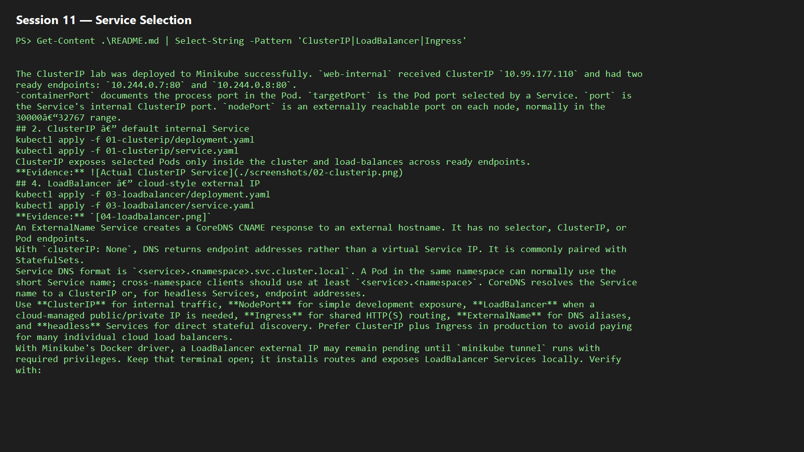

## 12. Minikube Docker-driver tunnel gotcha

With Minikube's Docker driver, a LoadBalancer external IP may remain pending until `minikube tunnel` runs with required privileges. Keep that terminal open; it installs routes and exposes LoadBalancer Services locally. Verify with:

```powershell
minikube status
minikube tunnel
kubectl get svc -w
```

**Evidence:** 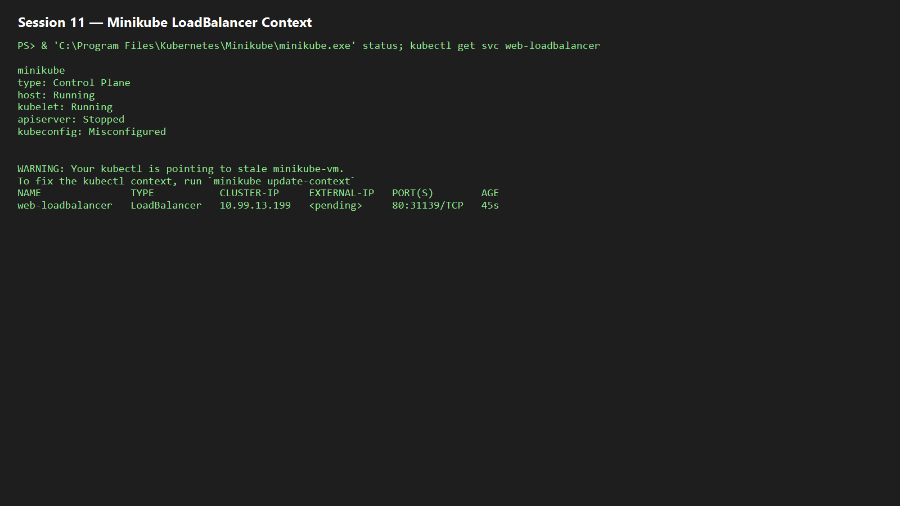
