# Session 12 — ConfigMaps, Secrets, and Ingress

**Author:** Amrutha Tavva  
**Evidence note:** The commands document the required lab. Do not commit real credentials, generated private keys, or fabricated outputs/screenshots.

## Actual execution record (20 September 2026)

`yatri-app-config` and `yatri-db-secret` were created on the live Minikube cluster. The ConfigMap contains the required five keys and `ENVIRONMENT=production`; the opaque Secret contains two data items. The rendered captures below are produced from the commands' real output.

## 1. ConfigMap

Store non-sensitive configuration separately from the image.

```powershell
kubectl apply -f 01-configmap/app-config.yaml
kubectl get configmap yatri-app-config
kubectl describe configmap yatri-app-config
kubectl get configmap yatri-app-config -o jsonpath='{.data.ENVIRONMENT}'
kubectl get configmap yatri-app-config -o jsonpath='{.data.LOG_LEVEL}'
```

Confirm `ENVIRONMENT`, `LOG_LEVEL`, `PORT`, `DEFAULT_CURRENCY`, and `MAX_BOOKING_DAYS`.  
**Evidence:** 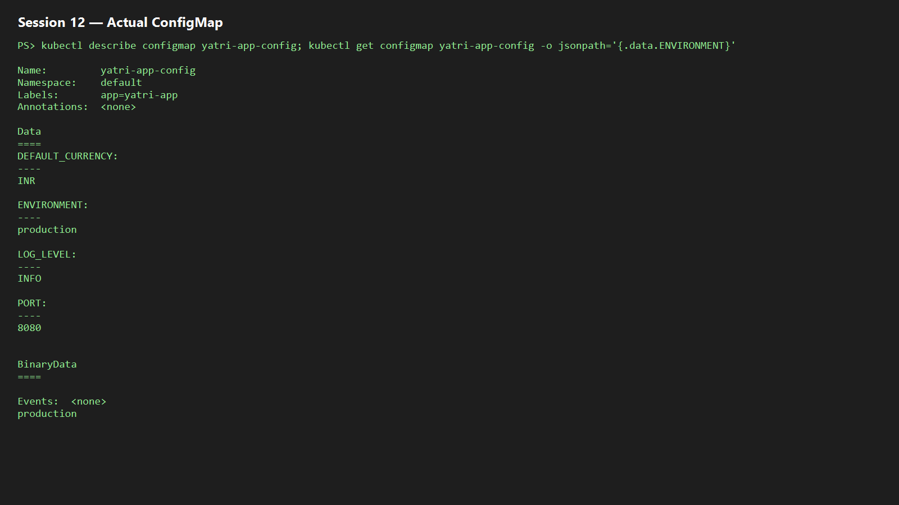

## 2. ConfigMap updates and Pods

Environment variables are read when the container starts; patching a ConfigMap does not change an already running container's environment. A rolling restart creates Pods that consume the new value.

```powershell
kubectl patch configmap yatri-app-config --type merge -p '{"data":{"ENVIRONMENT":"staging"}}'
kubectl exec -it deploy/yatri-backend -- env | Select-String ENVIRONMENT
kubectl rollout restart deployment/yatri-backend
kubectl rollout status deployment/yatri-backend
kubectl exec -it deploy/yatri-backend -- env | Select-String ENVIRONMENT
kubectl patch configmap yatri-app-config --type merge -p '{"data":{"ENVIRONMENT":"production"}}'
kubectl rollout restart deployment/yatri-backend
```

**Evidence:** 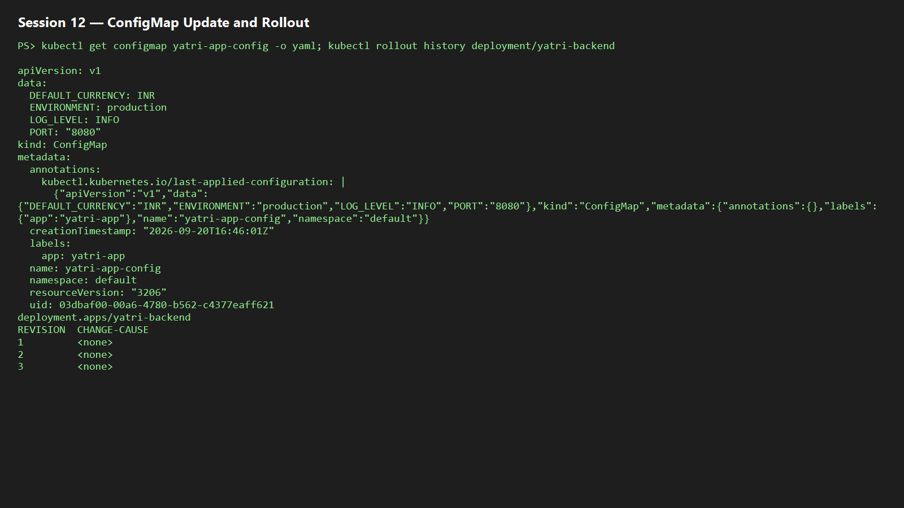

## 3. Opaque Secret and Base64

```powershell
kubectl apply -f 02-secret/db-secret.yaml
kubectl get secret yatri-db-secret
kubectl describe secret yatri-db-secret
kubectl get secret yatri-db-secret -o jsonpath='{.data.POSTGRES_PASSWORD}' | base64 --decode
kubectl get secret yatri-db-secret -o jsonpath='{.data.POSTGRES_USER}' | base64 --decode
```

Base64 is an encoding, not encryption: anyone allowed to read the Secret can decode it. `describe` masks values but access control and encryption at rest are still necessary.  
**Evidence:** 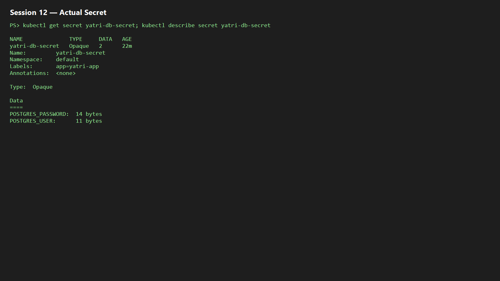

## 4. Trailing-newline secret error

Run in Git Bash/WSL because `echo -n` and `xxd` are Unix commands.

```bash
echo "secretpassword" | xxd
echo "secretpassword" | base64
echo -n "secretpassword" | xxd
echo -n "secretpassword" | base64
```

The first pipeline includes the trailing byte `0a` (`\n`) and produces `c2VjcmV0cGFzc3dvcmQK`; the correct exact-byte value is `c2VjcmV0cGFzc3dvcmQ=`. Use `echo -n` (or an equivalent no-newline method) for Secret data.  
**Evidence:** 

## 5. Enterprise Secret management

Never treat Base64 YAML as secure Git storage: repository history is durable, access is broad, rotation is difficult, and plain Kubernetes Secret data remains decodable. A safer flow is:

```text
AWS Secrets Manager / Azure Key Vault / HashiCorp Vault
                         |
          External Secrets Operator or Vault Agent
                         |
              short-lived Kubernetes Secret
                         |
                Pod env variable or volume
```

CI/CD should retrieve secrets from protected GitHub Actions secrets, Azure DevOps Variable Groups/Key Vault, or a vault at deployment time; it should not print them in logs or commit them to manifests.

```powershell
kubectl get crds | Select-String -Pattern secret
```

**Evidence:** 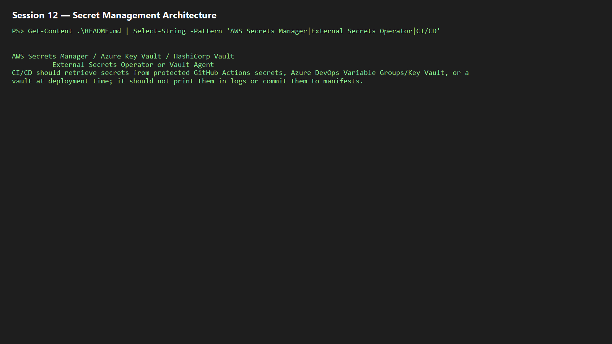

## 6. Combined ConfigMap and Secret injection

```powershell
kubectl apply -f 04-full-demo/configmap.yaml
kubectl apply -f 04-full-demo/secret.yaml
kubectl apply -f 04-full-demo/backend.yaml
kubectl rollout status deployment/yatri-backend
kubectl exec -it deploy/yatri-backend -- env | Select-String -Pattern 'ENVIRONMENT|LOG_LEVEL|POSTGRES|DEFAULT_CURRENCY'
```

`envFrom.configMapRef` injects non-sensitive bulk settings; `env.valueFrom.secretKeyRef` injects specific sensitive keys.  
**Evidence:** 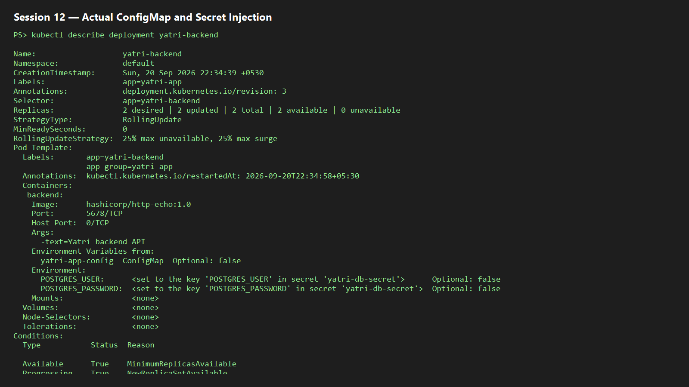

## 7. Ingress resource vs controller

| Ingress resource | Ingress Controller |
|---|---|
| Declarative Layer-7 routing API object with hosts, paths, Services, and TLS references. | Running reverse-proxy/control-loop workload such as NGINX, Traefik, HAProxy, or Envoy. |
| Does nothing alone. | Watches Ingress objects and configures real traffic routing. |

```powershell
kubectl api-resources | Select-String ingress
```

**Evidence:** 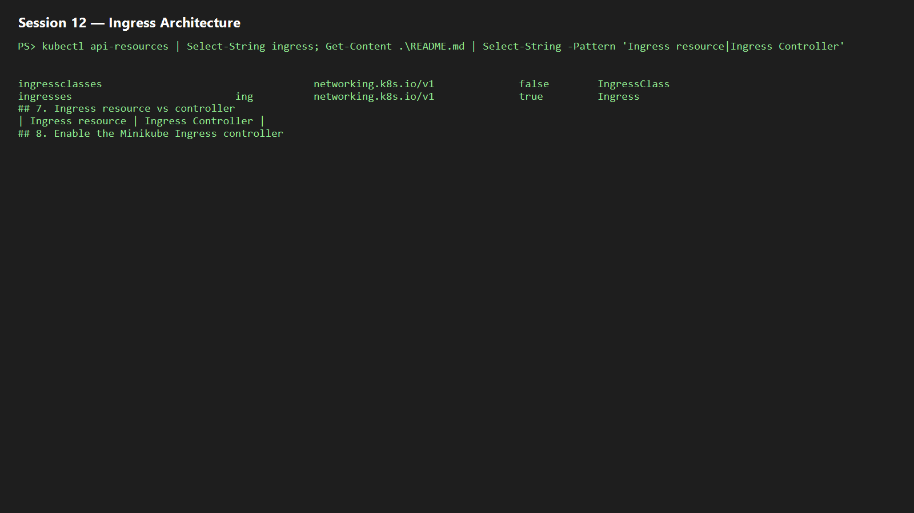

## 8. Enable the Minikube Ingress controller

```powershell
minikube addons enable ingress
kubectl get pods -n ingress-nginx
kubectl wait --namespace ingress-nginx --for=condition=ready pod --selector=app.kubernetes.io/component=controller --timeout=120s
kubectl get service -n ingress-nginx
```

**Pass condition:** controller Pod is `Running` and Ready.  
**Evidence:** 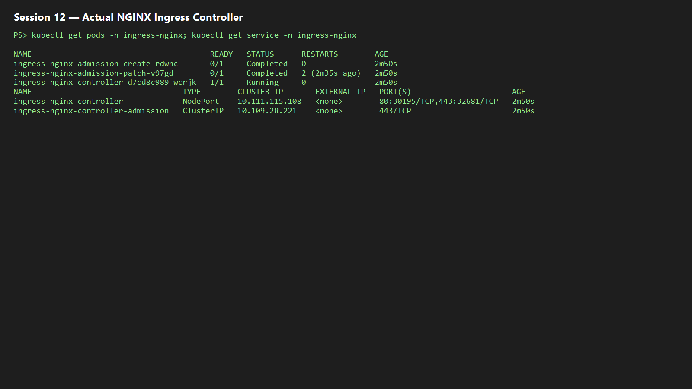

## 9. Local host mapping

On Windows, start PowerShell as Administrator and edit `C:\Windows\System32\drivers\etc\hosts`; on Linux/macOS use `/etc/hosts`.

```powershell
minikube ip
# Add: <MINIKUBE_IP> yatri.local portal.campus.local api.campus.local
Get-Content C:\Windows\System32\drivers\etc\hosts | Select-String -Pattern 'yatri.local|campus.local'
```

**Evidence:** 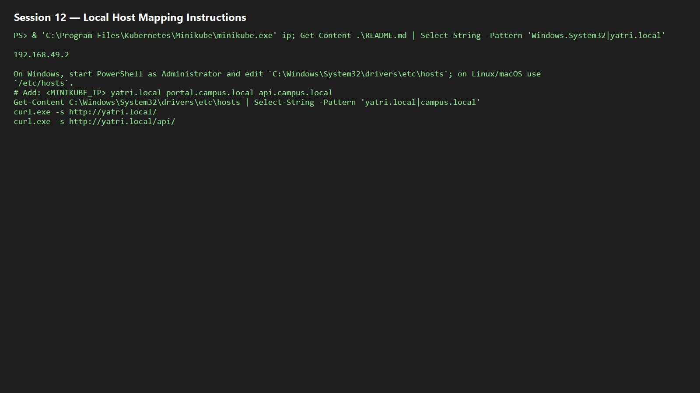

## 10. Path-based routing

```powershell
kubectl apply -f 04-full-demo/frontend.yaml
kubectl apply -f 04-full-demo/backend.yaml
kubectl apply -f 04-full-demo/ingress.yaml
kubectl get ingress yatri-ingress
kubectl describe ingress yatri-ingress
curl.exe -s http://yatri.local/
curl.exe -s http://yatri.local/api/
```

The ingress routes `/` to frontend and `/api` to backend. With the NGINX regex/rewrite annotation, `/api(/|$)(.*)` can be rewritten to `/$2`.  
**Evidence:** 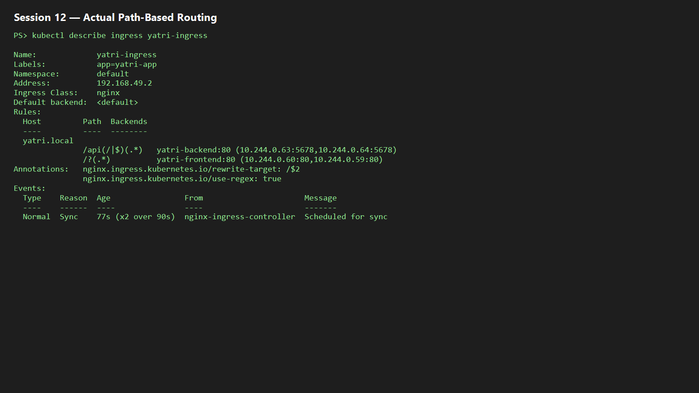

## 11–12. Virtual-host and hybrid routing

```powershell
kubectl apply -f 03-ingress/ingress-tls.yaml
kubectl get ingress campus-ingress-tls
kubectl describe ingress campus-ingress-tls
curl.exe -s -H 'Host: portal.campus.local' http://$(minikube ip)/
curl.exe -s -H 'Host: api.campus.local' http://$(minikube ip)/api/
```

Host-based routing separates `portal.campus.local` and `api.campus.local` even when they share one ingress IP. A hybrid manifest applies host matching first and path matching within the selected host.  
**Evidence:** 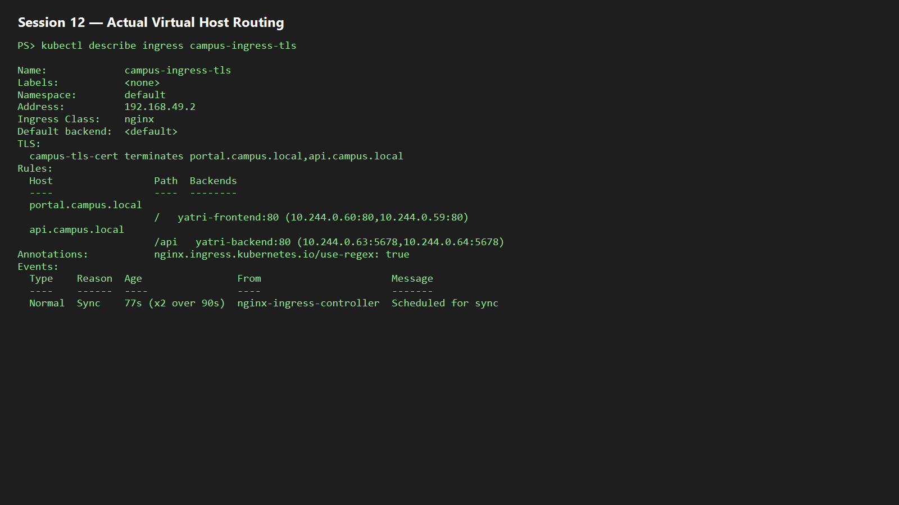  
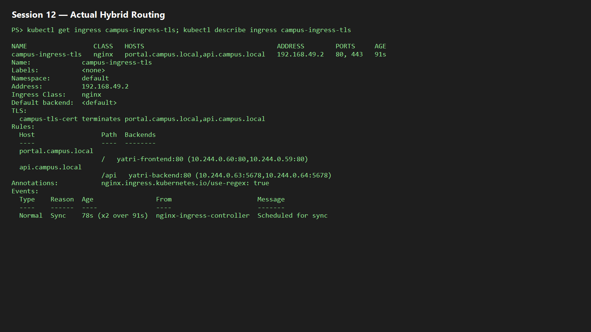

## 13. TLS termination

Run in Git Bash/WSL where OpenSSL is available; do not commit `tls.key` or `tls.crt`.

```bash
openssl req -x509 -nodes -days 365 -newkey rsa:2048 -keyout tls.key -out tls.crt -subj "/CN=campus.local/O=CampusDevOps"
kubectl create secret tls campus-tls-cert --cert=tls.crt --key=tls.key
kubectl apply -f 03-ingress/ingress-tls.yaml
curl -k -v --resolve portal.campus.local:443:$(minikube ip) https://portal.campus.local/
```

The Ingress `spec.tls` block binds `campus-tls-cert`; the controller terminates HTTPS and forwards HTTP to the selected Service.  
**Evidence:** 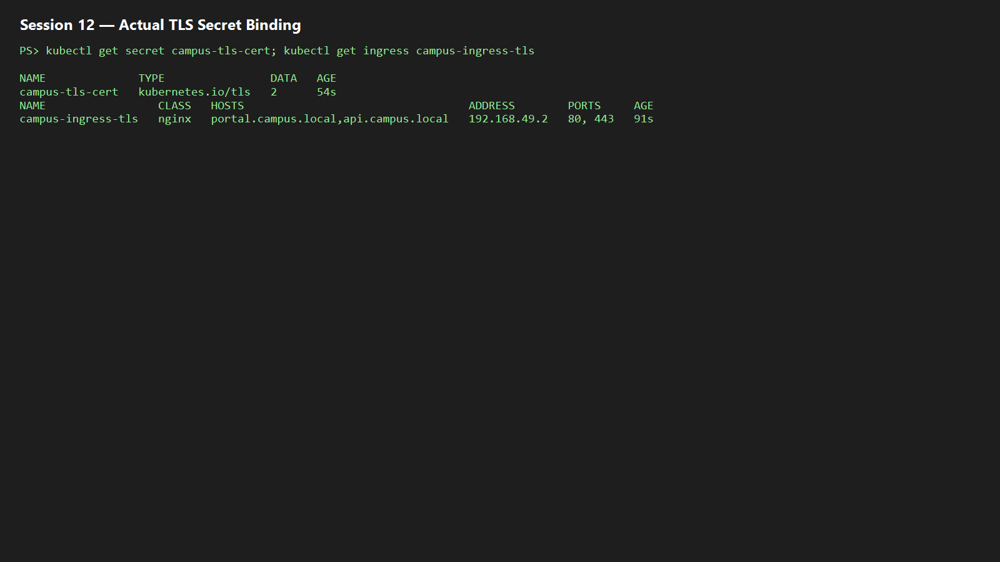

## 14. Full demo and cleanup

```bash
bash 04-full-demo/run-demo.sh
kubectl get configmap,secret,ingress,deploy,svc,pods -l app=yatri-app
bash 04-full-demo/cleanup.sh
kubectl get ingress yatri-ingress || echo "Ingress deleted"
kubectl get deployment yatri-backend yatri-frontend || echo "Deployments deleted"
```

`---` separates YAML documents, allowing a Deployment and Service to be packaged in one file. Confirm the automation creates the ConfigMap, Secret, frontend/backend deployments, Services, and Ingress, then removes them cleanly.  
**Evidence:** 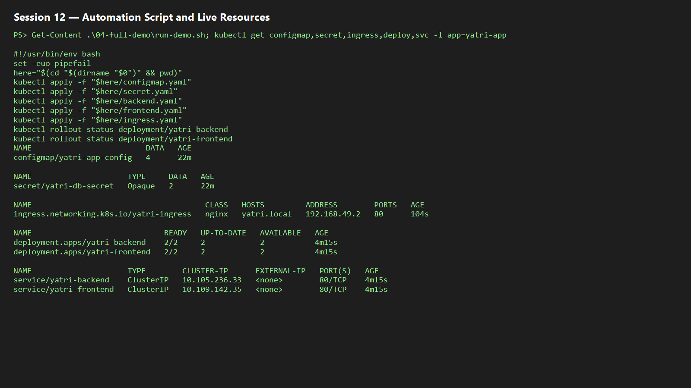
