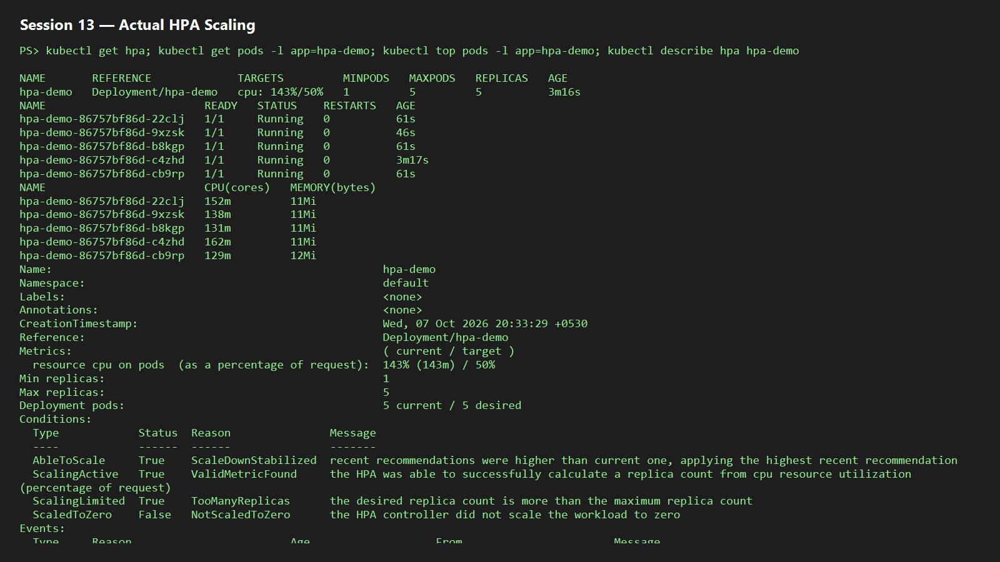
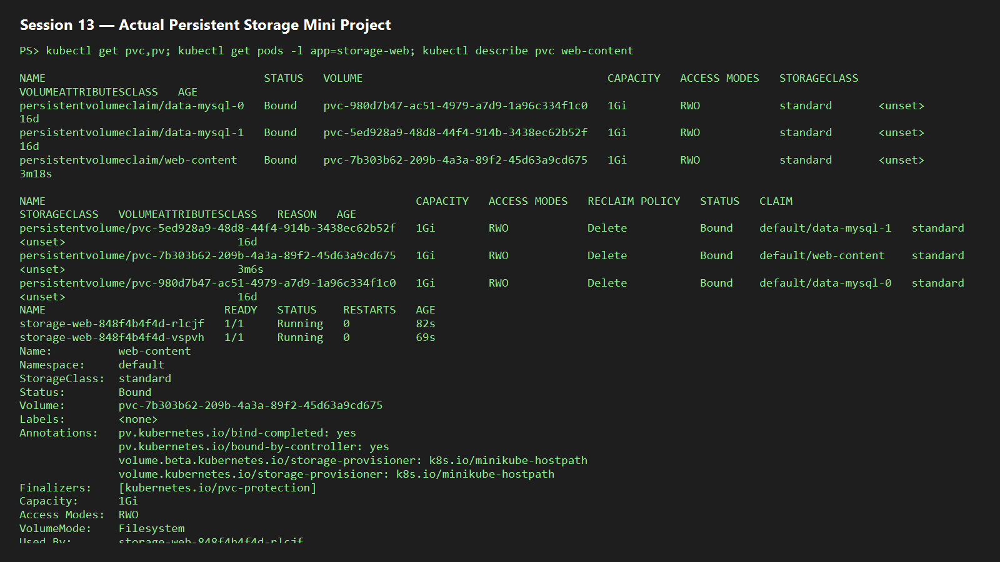

# Session 13 — Kubernetes Storage, HPA, and Probes

## Task 1 — Volumes

See [volume documentation](./01-kubernetes-volumes/README.md). The mini-project uses a dynamically provisioned PVC and readiness/liveness probes.

## Task 2 — HPA hands-on

```powershell
kubectl apply -f 02-hpa/hpa.yml
kubectl apply -f 02-hpa/load-generator.yml
kubectl get hpa -w
kubectl get pods -w
kubectl top pods
kubectl describe hpa hpa-demo
```

Metrics Server is required for `kubectl top` and HPA CPU calculations. On Minikube: `minikube addons enable metrics-server`.

Expected behavior: CPU crosses 50% of the 100m request, the HPA increases replicas up to 5, and it scales down after load is removed.

**Actual evidence:** During execution on 7 October 2026, the load generator drove CPU to `491%` of request. HPA increased the deployment from one to five replicas.



## Task 3 — Mini project

```powershell
kubectl apply -f mini-project/pvc.yaml
kubectl apply -f mini-project/app.yaml
kubectl get pvc,pv,pods,svc
kubectl describe pvc web-content
```

The project demonstrates durable storage, a Service, and health probes. Capture `kubectl get hpa`, `kubectl top pods`, `kubectl describe hpa`, and `kubectl get pvc,pv,pods` in `screenshots/` after the cluster is running.

**Actual evidence:** The default `standard` StorageClass dynamically provisioned and bound a 1Gi PV for `web-content`. The first deployment surfaced an empty-volume/probe issue; an init container now initializes `index.html` before NGINX starts, and both replicas became Ready.


