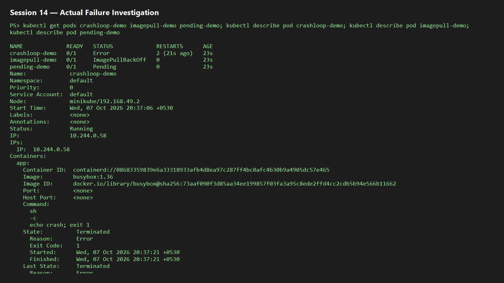
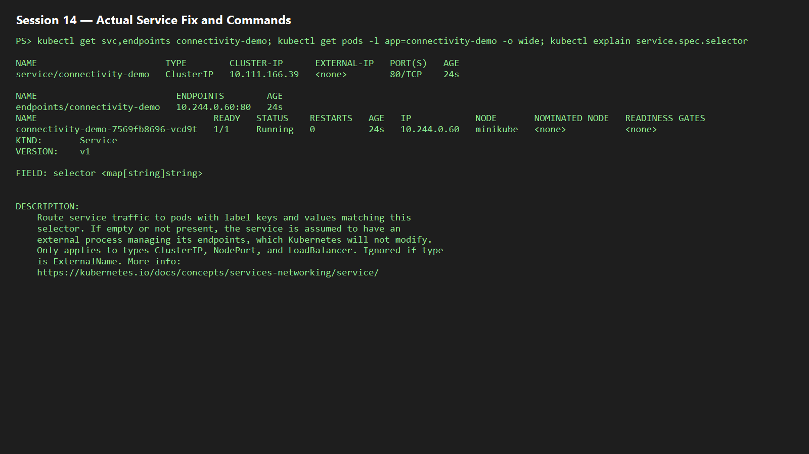

# Session 14 — Kubernetes Troubleshooting

## Command toolkit

| Command | Purpose |
|---|---|
| `kubectl get pods -o wide` | Status, node, and Pod IP |
| `kubectl describe pod NAME` | Events, conditions, scheduling, image errors |
| `kubectl logs NAME --previous` | Logs from a crashed container |
| `kubectl exec -it NAME -- sh` | Inspect a running container |
| `kubectl get events --sort-by=.lastTimestamp` | Ordered cluster events |
| `kubectl explain deployment.spec` | Built-in API documentation |
| `kubectl top pods` | CPU/memory usage (Metrics Server required) |

## Issue runbook

| Issue | Investigate | Root cause | Fix | Verify |
|---|---|---|---|---|
| CrashLoopBackOff | `logs --previous`, `describe` | Process exits non-zero | Correct command/config | `Running`, restart count stabilizes |
| ErrImagePull/ImagePullBackOff | `describe` Events | Invalid image/name/tag or auth | Correct image / imagePullSecret | Image pulls; Pod starts |
| Pending | `describe` Events | No node fits resource request | Reduce request/add capacity | Pod schedules |
| ContainerCreating | `describe`, events | Image/volume/CNI initialization | Resolve reported dependency | Pod becomes Running |
| Service failure | `get svc,endpoints`, label check | Selector does not match ready Pods | Align labels/ports | Endpoints populate and curl succeeds |
| DNS failure | `exec ... nslookup`, CoreDNS logs | Bad name/namespace or CoreDNS issue | Use FQDN/fix DNS | Lookup resolves |
| Pod networking | `get -o wide`, CNI events | CNI/NetworkPolicy/routing | Repair CNI/policy | Pod-to-Pod request succeeds |
| Configuration | `describe`, ConfigMap/Secret checks | Missing/wrong key or immutable env | Correct reference; rollout restart | Correct env in new Pod |

## Hands-on and mini project

```powershell
kubectl apply -f manifests/crashloop.yaml
kubectl describe pod crashloop-demo; kubectl logs crashloop-demo --previous
kubectl apply -f manifests/imagepull.yaml
kubectl describe pod imagepull-demo
kubectl apply -f manifests/pending.yaml
kubectl describe pod pending-demo
kubectl apply -f manifests/service-fix.yaml
kubectl get svc,endpoints,pods -l app=connectivity-demo
```

The mini project is a broken-workload investigation: use the commands above to identify each failure, apply the corrected `service-fix.yaml`, then record before/after output in `screenshots/`.

## Actual execution evidence

On 7 October 2026, the cluster reproduced all three failures: `crashloop-demo` exited with code 1 and restarted; `imagepull-demo` showed `ErrImagePull` then `ImagePullBackOff` for a nonexistent tag; and `pending-demo` had a `FailedScheduling` event because it requests 1000Gi of memory. The corrected Service selected a ready endpoint successfully.




