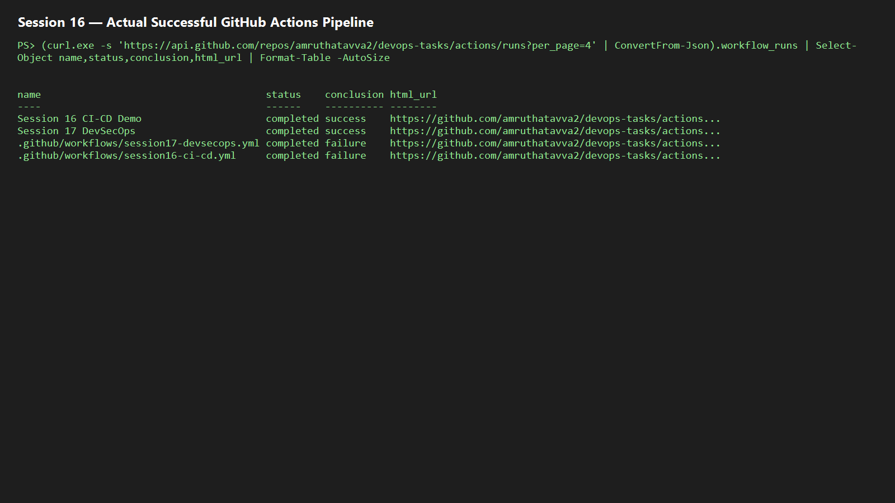

# Session 16 — CI/CD and GitHub Actions

This demo has an Express application, unit test, Dockerfile, and GitHub Actions workflow.

CI validates code by installing dependencies and running tests. CD is the controlled delivery stage after CI; it builds an image and can deploy it once registry/Kubernetes credentials are supplied.

Workflow concepts: a **workflow** is the YAML pipeline; **jobs** run on hosted **runners**; **steps** are commands/actions. GitHub Secrets should hold registry/Kubernetes credentials. Artifacts can be added with `actions/upload-artifact` for reports.

Run locally: `cd app; npm install; npm test`. Push this folder to GitHub and capture the green Actions run under `screenshots/`.

## Actual pipeline evidence

The root GitHub Actions workflow ran successfully on 7 October 2026 for commit `acb1776`, completing the test and Docker build jobs.

