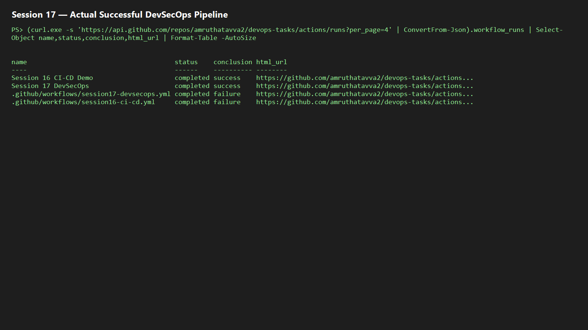

# Session 17 — CI/CD and DevSecOps

Pipeline flow: **code → build → unit test → SAST (CodeQL) → SCA (`npm audit`) → secret scan (Gitleaks) → Docker build → image scan (Trivy) → security gate → push/deploy**.

The security gate is `exit-code: 1` for high/critical findings, so a vulnerable build cannot progress. Before enabling push/deploy, replace `OWNER` in `k8s/deployment.yaml`, configure registry authentication, and store Kubernetes credentials as a GitHub Secret. Do not commit credentials.

Run local test: `cd app; npm install; npm test`. Push to GitHub to execute CodeQL, Gitleaks, and Trivy; keep the successful Actions capture in `screenshots/`.

## Actual pipeline evidence

The root Session 17 workflow completed successfully on 7 October 2026 for commit `acb1776`, executing tests, dependency audit, CodeQL, Gitleaks, Trivy filesystem scanning, and the Docker image build.

