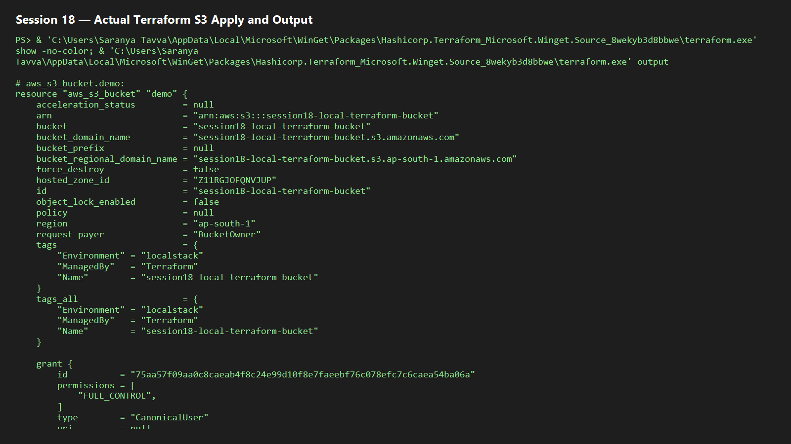
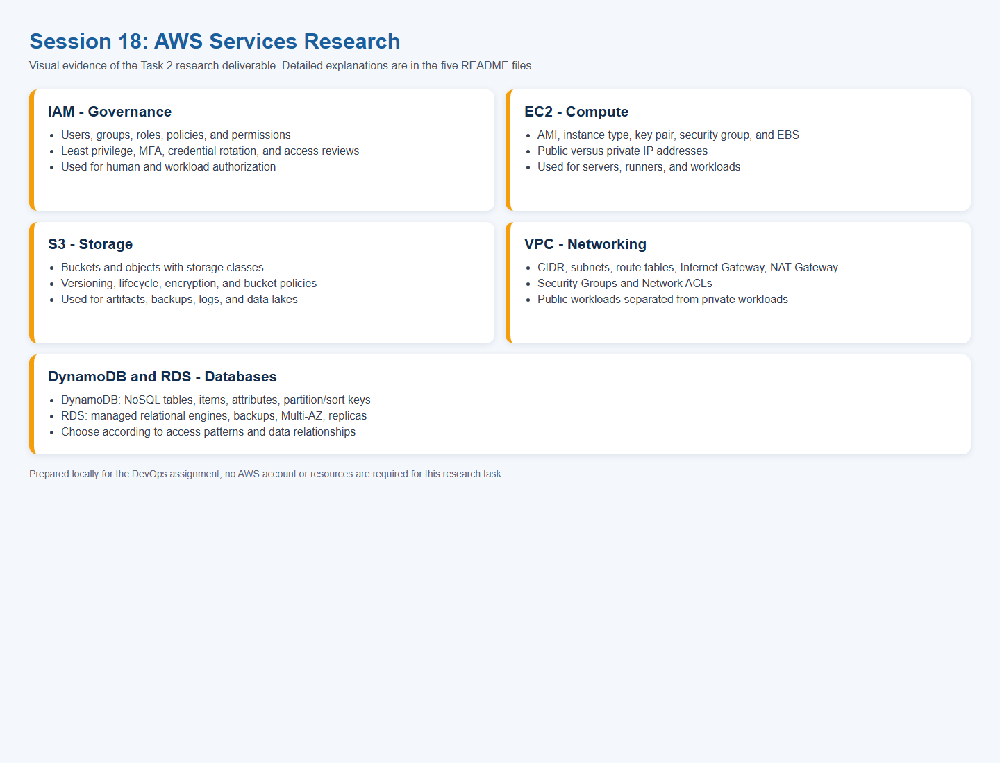

# Session 18 — Terraform and AWS Research

## Task 1 — Terraform S3 demo

This session includes `terraform-s3-demo/` with `provider.tf`, `variables.tf`, `main.tf`, `outputs.tf`, and `terraform.tfvars.example`. The configuration creates an S3 bucket with versioning, SSE-S3 encryption, public-access blocking, tags, and outputs for its name and ARN.

```powershell
terraform init
terraform fmt
terraform validate
terraform plan
terraform apply
terraform show
terraform output
terraform destroy
```

`init` downloads providers; `fmt` standardizes HCL; `validate` checks syntax/configuration; `plan` previews infrastructure; `apply` creates it; `show` displays state; `output` prints declared values; and `destroy` removes managed resources. Copy `terraform.tfvars.example` to `terraform.tfvars` and set a globally unique bucket name before real AWS use. Never commit credentials or state files.

### Local no-account execution

The repository supports LocalStack, an AWS-compatible local emulator. It produces genuine Terraform output without AWS credentials or charges:

```powershell
docker compose -f ../localstack-compose.yml up -d
cd terraform-s3-demo
terraform init
terraform plan -var-file=local.tfvars
terraform apply -auto-approve -var-file=local.tfvars
terraform show
terraform output
terraform destroy -auto-approve -var-file=local.tfvars
```

LocalStack is valid lab evidence for Terraform workflow practice but is not a real AWS deployment.

### Actual local execution evidence

The complete S3 workflow was executed locally on 7 October 2026. Terraform initialized and validated the configuration, planned and applied four resources (`aws_s3_bucket`, versioning, server-side encryption, and public-access blocking), and returned the bucket name and ARN as outputs. The final `destroy` completed successfully, so no emulated S3 resources were left behind.



## Task 2 — AWS services research

The detailed research is included below and in the corresponding service folders. The rendered research-summary evidence is also captured here:



### 1. IAM — Governance

IAM controls AWS authentication and authorization. **Users** represent people/workloads; **groups** organize users; **roles** provide temporary assumable permissions; and **policies** define allowed or denied actions on resources. Follow least privilege, use roles rather than long-lived keys, require MFA, remove unused credentials, and review access regularly. Typical uses include developer access, EC2 instance roles, and cross-account access.

### 2. EC2 — Compute

EC2 is on-demand virtual compute. An **AMI** is the machine image; **instance types** define CPU/memory/networking; **key pairs** allow SSH access; **Security Groups** are stateful firewalls; and **EBS** is persistent block storage. Public IPs are internet reachable through an Internet Gateway, while private IPs are internal to a VPC. Lifecycle states include pending, running, stopping/stopped, and terminated. Common uses are web servers, build runners, and legacy workloads.

### 3. S3 — Storage

S3 stores **objects** inside **buckets**. Storage classes balance cost and access needs: Standard, Intelligent-Tiering, Standard-IA, and Glacier. Versioning preserves object revisions; lifecycle policies transition or expire objects; encryption protects stored data; and bucket policies define resource-level access. Common uses include backups, static websites, logs, artifacts, and data lakes.

### 4. VPC — Networking

A VPC is an isolated virtual network with a CIDR range. **Subnets** segment that network across Availability Zones; **route tables** choose traffic paths; an **Internet Gateway** enables public connectivity; and a **NAT Gateway** enables outbound access for private subnets. Security Groups are stateful instance firewalls, whereas Network ACLs are stateless subnet filters. Public load balancers belong in public subnets; databases and internal workloads belong in private subnets.

### 5. DynamoDB and RDS — Databases

**DynamoDB** is managed NoSQL storage with tables, items, and attributes. A partition key distributes data; an optional sort key orders items within a partition. It suits sessions, carts, and high-scale key/value workloads.

**RDS** is managed relational database hosting PostgreSQL, MySQL, MariaDB, Oracle, and SQL Server. DB instances use private networking and Security Groups; backups, encryption, Multi-AZ, and read replicas improve resilience and scale. It suits transactional applications and relational reporting.

## Verification status

Terraform, Helm, AWS CLI, Docker, Minikube, and kubectl are installed locally. The S3 exercise has been verified through LocalStack. A real AWS `apply` remains optional and requires your own configured AWS account; the LocalStack route above avoids that requirement.
