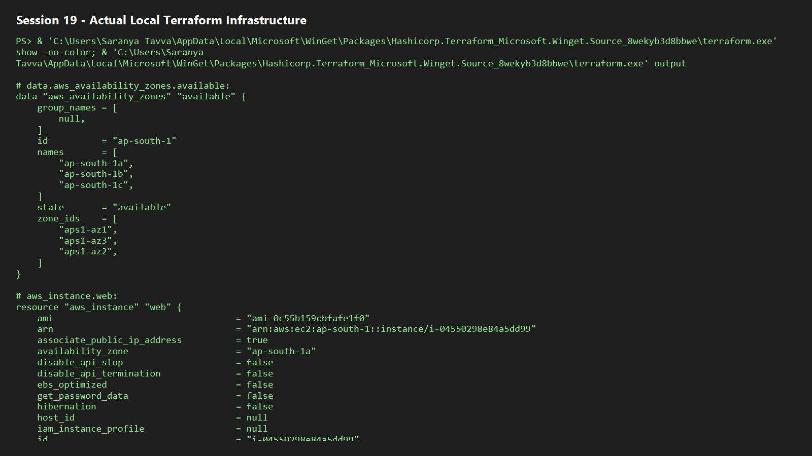

# Session 19 — Cloud and Terraform in Action

```text
Terraform
 ├─ VPC (10.20.0.0/16)
 │   ├─ Internet Gateway and public route table
 │   ├─ Public subnet (10.20.1.0/24)
 │   ├─ Security Group (HTTP + SSH)
 │   └─ EC2 web instance
 └─ Private S3 bucket
```

## Runbook

1. Install/configure AWS CLI: `aws configure`.
2. Copy `terraform.tfvars.example` to `terraform.tfvars`; supply an existing key pair, unique bucket name, and a current regional Amazon Linux AMI ID.
3. Execute:

```powershell
terraform init
terraform fmt -check
terraform validate
terraform plan
terraform apply
terraform show
terraform output
terraform destroy
```

Terraform records resource IDs in `terraform.tfstate`; do not commit this file because it may contain sensitive metadata. Dependencies are inferred from resource references: the subnet depends on the VPC, routing depends on the Internet Gateway, and EC2 depends on subnet/security group.

`apply` creates billable AWS resources when pointed at AWS. Capture `plan`, successful `apply`, AWS Console resources, `output`, and `destroy` in `screenshots/` after credentials are configured.

## Local no-account option

Use the shared LocalStack container to emulate AWS endpoints locally:

```powershell
docker compose -f ../localstack-compose.yml up -d
terraform init
terraform plan -var-file=local.tfvars
terraform apply -auto-approve -var-file=local.tfvars
terraform output
terraform destroy -auto-approve -var-file=local.tfvars
```

LocalStack demonstrates Terraform provider/resources/state behavior without AWS billing. EC2/VPC emulation is not a substitute for a real AWS deployment.

## Actual local execution evidence

On 7 October 2026, this configuration was initialized, validated, planned, and applied against LocalStack. Terraform created eight resources: an S3 bucket, VPC, Internet Gateway, public subnet, route table, route-table association, security group, and EC2 instance. The outputs included the VPC ID, subnet ID, bucket name, and an emulated EC2 public IP. The following `terraform destroy` completed with **8 destroyed**, leaving no lab resources running.



## Verification status

The project is formatted and has been successfully exercised through LocalStack without AWS credentials or charges. A real AWS deployment remains optional and requires your own configured AWS account, key pair, AMI, and globally unique bucket name.
