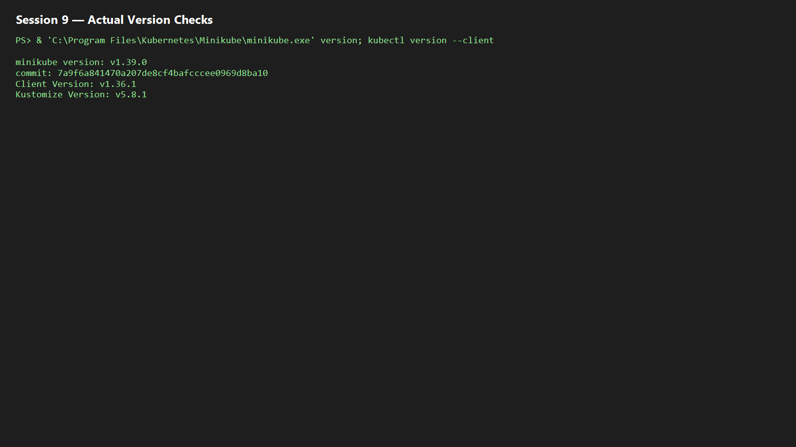
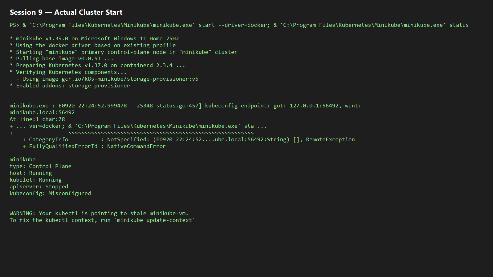
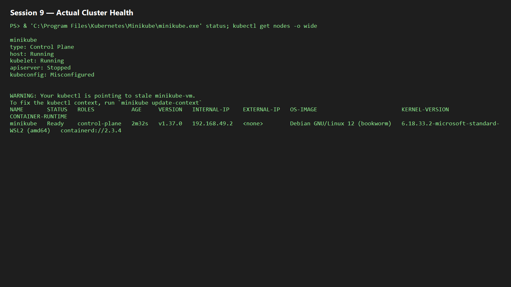
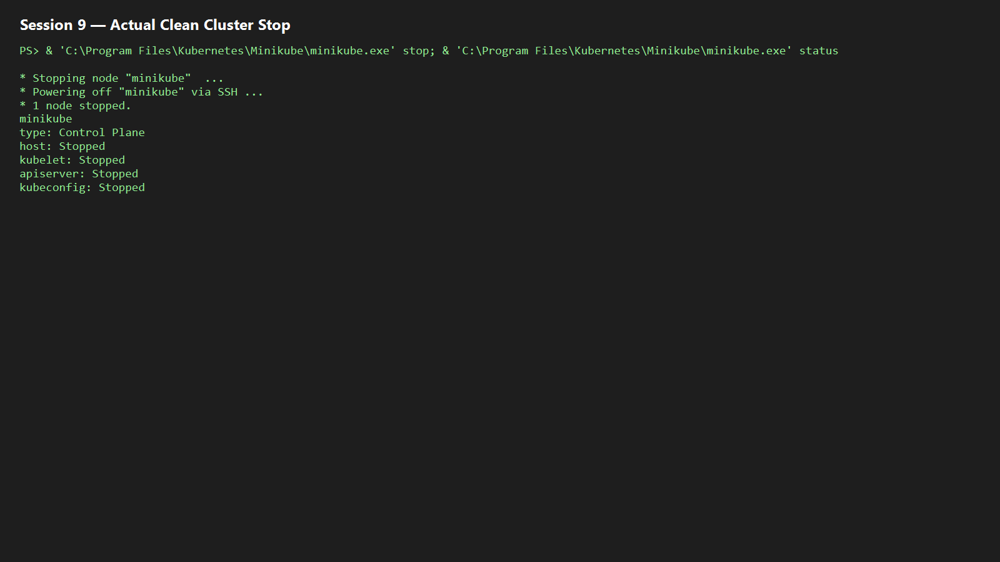
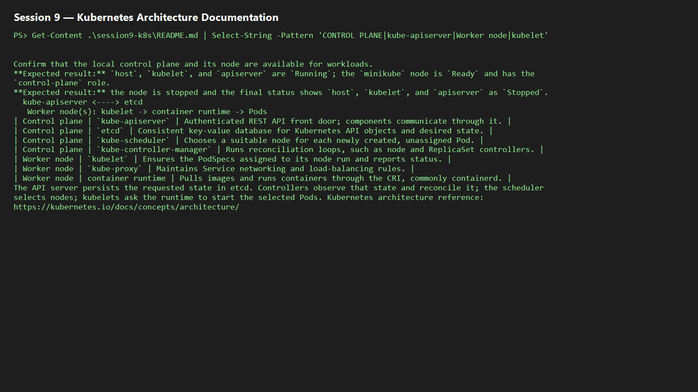

# Session 9 — Kubernetes Fundamentals and Minikube

**Author:** Amrutha Tavva
**Repository:** `devops-heros/session9-k8s`  
**Evidence note:** Replace each evidence placeholder below with the real terminal output and screenshot before submitting.

## Actual execution record (20 September 2026)

Minikube `v1.39.0` and kubectl client `v1.36.1` were verified on Windows. The Docker-driver cluster was started successfully with Kubernetes `v1.37.0`; its sole `minikube` control-plane node was `Ready` at `192.168.49.2`. The captured evidence is included below.

## Task 1 — Verify Minikube and kubectl

Minikube supplies a local Kubernetes cluster; `kubectl` is the cluster CLI.

```powershell
minikube version
kubectl version --client
```

**Expected result:** both commands print installed version information.  
**Evidence:** 

## Task 2 — Start the local cluster

Start a single-node Kubernetes cluster using the available Minikube driver.

```powershell
minikube start
```

**Expected result:** Minikube reports that `kubectl` is configured for the `minikube` cluster.  
**Evidence:** 

## Task 3 — Verify control-plane and node health

Confirm that the local control plane and its node are available for workloads.

```powershell
minikube status
kubectl get nodes -o wide
```

**Expected result:** `host`, `kubelet`, and `apiserver` are `Running`; the `minikube` node is `Ready` and has the `control-plane` role.  
**Evidence:** 

## Task 4 — Stop the cluster cleanly

Stop Minikube after the checks to release local resources.

```powershell
minikube stop
minikube status
```

**Expected result:** the node is stopped and the final status shows `host`, `kubelet`, and `apiserver` as `Stopped`.  
**Evidence:** 

## Task 5 — Kubernetes architecture

```text
kubectl / controllers
        |
  kube-apiserver <----> etcd
        |                 (desired cluster state)
        +---- scheduler (selects a node for unscheduled Pods)
        +---- controller-manager (reconciles desired and actual state)
        |
   Worker node(s): kubelet -> container runtime -> Pods
                   kube-proxy -> Service network rules
```

| Area | Component | Responsibility |
|---|---|---|
| Control plane | `kube-apiserver` | Authenticated REST API front door; components communicate through it. |
| Control plane | `etcd` | Consistent key-value database for Kubernetes API objects and desired state. |
| Control plane | `kube-scheduler` | Chooses a suitable node for each newly created, unassigned Pod. |
| Control plane | `kube-controller-manager` | Runs reconciliation loops, such as node and ReplicaSet controllers. |
| Worker node | `kubelet` | Ensures the PodSpecs assigned to its node run and reports status. |
| Worker node | `kube-proxy` | Maintains Service networking and load-balancing rules. |
| Worker node | container runtime | Pulls images and runs containers through the CRI, commonly containerd. |
| Workload | Pod | Smallest deployable Kubernetes object; one or more containers sharing network and volumes. |

The API server persists the requested state in etcd. Controllers observe that state and reconcile it; the scheduler selects nodes; kubelets ask the runtime to start the selected Pods. Kubernetes architecture reference: https://kubernetes.io/docs/concepts/architecture/

**Evidence:** 
